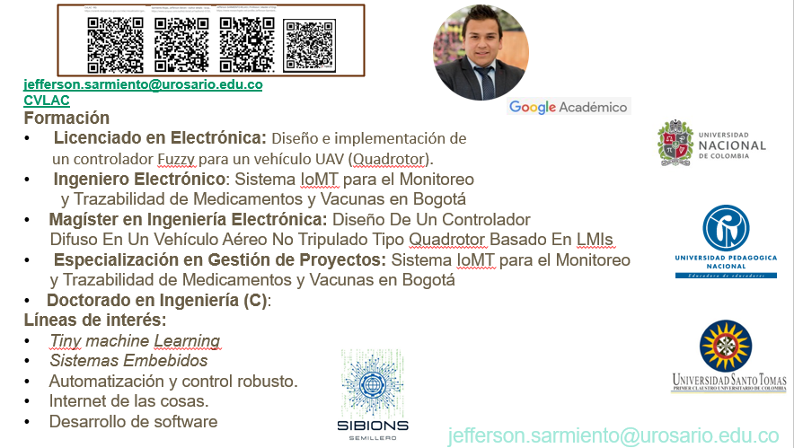
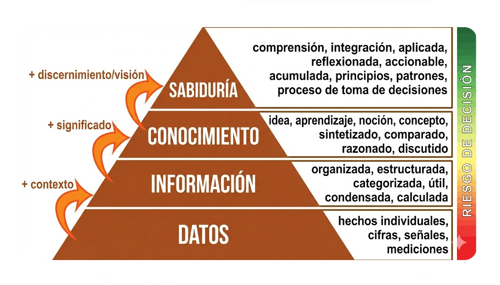
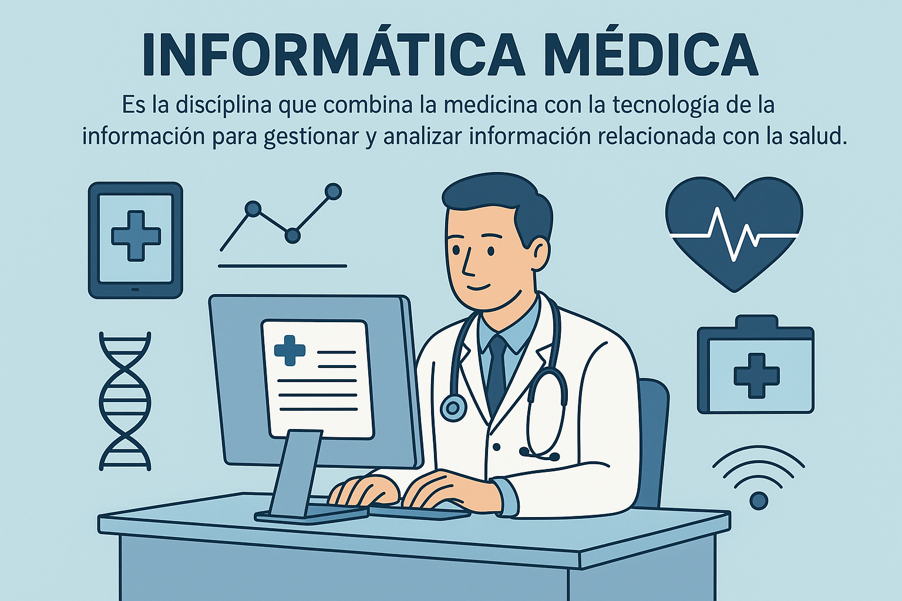
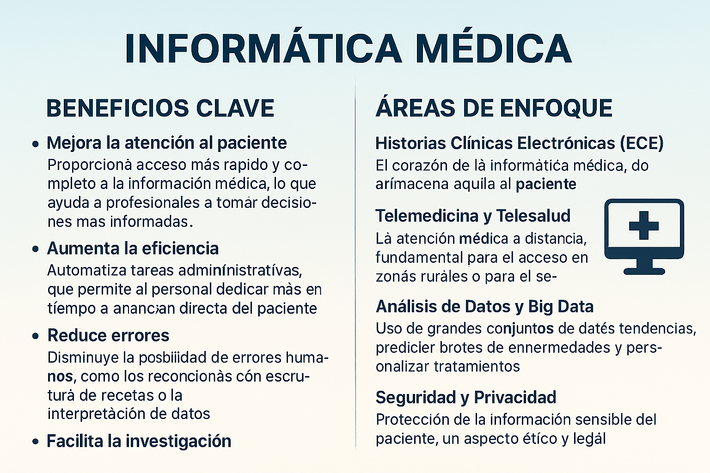

# 👨‍🏫 Información del Docente

## Jefferson Sarmiento Rojas, Ph.D (c)
{width="100%"}

# 🏥 Jerarquía del Conocimiento (Modelo DIKW)

## Pirámide DIKW
{width="80%"}

## Dato
- Símbolos o lecturas aisladas.
- Ejemplo: `[36.5, 39.2...]` sin contexto.

## Información
- Datos con contexto y significado.
- Ejemplo: `39.2 °C` (Sabemos qué estamos midiendo).

## Conocimiento
- Información comprendida y estructurada.
- Ejemplo: `Si temperatura > 37.5, entonces hay fiebre`. El conocimiento médico codificado.

## Sabiduría
- Conocimiento aplicado para la acción y resolución de problemas.
- Ejemplo: "El sistema sugiere administrar antipirético y priorizar atención".

# 📈 Evolución Clínica

## Flujos de trabajo
- Comprender cómo se mueve la información clínica y administrativa dentro de un hospital.
- {width="60%"}

## Transición de Tecnologías
- {width="80%"}

## Hacia la Salud 4.0
- Transición del registro en papel a sistemas totalmente digitalizados, inteligentes e interoperables.

# 💻 Práctica de Laboratorio

## Programando el Triaje (Reto DIKW)
Imagina un dispositivo IoT (como un smartwatch) midiendo pacientes en sala de espera.

**Reto Práctico:** 
Modifiquen el código del triage para agregar una segunda variable, como **Saturación de Oxígeno (SpO2)**, y describan paso a paso el ciclo DIKW para esta nueva variable de manera automática.
