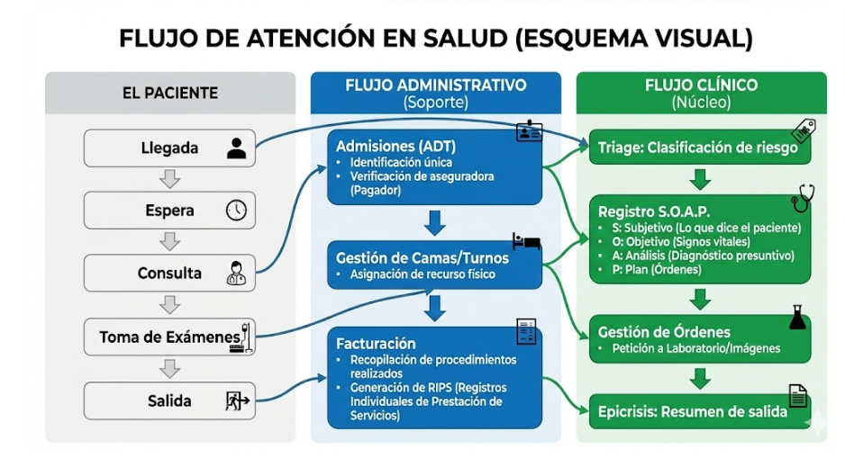
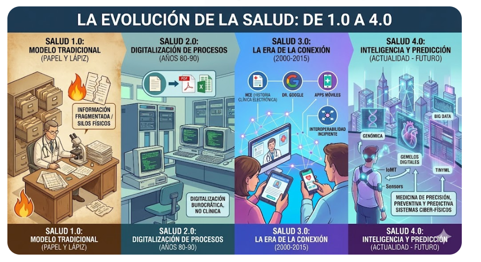
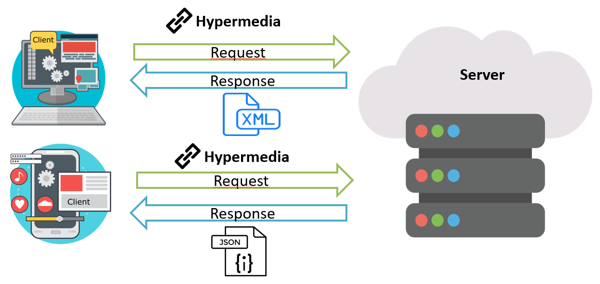
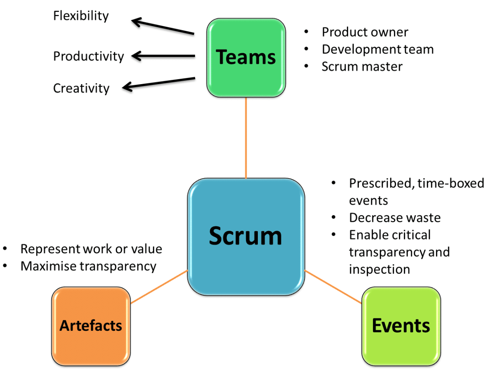
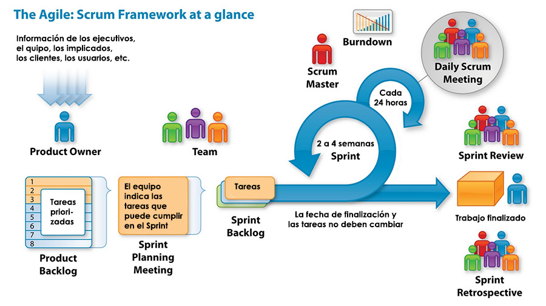
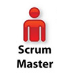
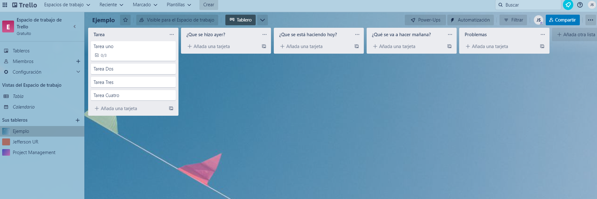
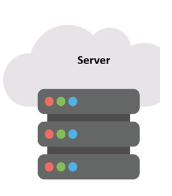
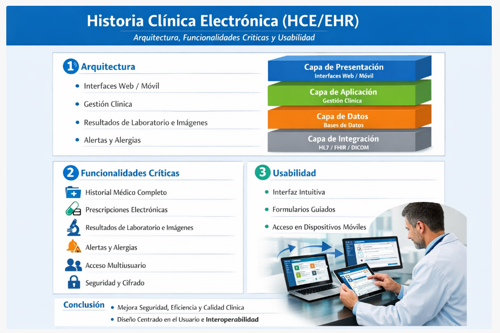

## Flujos de trabajo clínicos y administrativos
- Evolución constante de los procesos en las instituciones de salud.
- Optimización de recursos y tiempos de atención.

{width="70%" fig-align="center"}

## Del registro en papel a la Salud 4.0
- Transición del papel a los medios digitales.
- Integración de tecnologías IoT, Big Data e IA.
- Interoperabilidad de los datos médicos.

{width="70%" fig-align="center"}

## Paradigma Cliente - Servidor
- **Cliente (Frontend):** Interfaz visual donde interactúa el usuario.
- **Servidor (Backend):** Lógica y base de datos donde se procesa la información de manera segura.

{width="70%" fig-align="center"}

## Proceso para la planeación y ejecución
- Antes de desarrollar cualquier sistema de información en salud, se requiere una planificación rigurosa.
- Existen dos grandes caminos: Metodologías Clásicas y Metodologías Ágiles.

## Metodologías Clásicas
- Gestión estricta y organizada del cronograma (Gantt).
- Gestión de costos (directos, indirectos) y stakeholders.
- Gestión rigurosa de riesgos.
- Fases independientes.
- Adecuada para proyectos estáticos con un amplio rango de tiempo.

## Metodologías Ágiles
- Gestión organizada pero orientada a un estado cambiante.
- Fácil adaptación a las necesidades del cliente (Iterativo).
- Retroalimentación constante.
- Entregas rápidas (Sprints).
- Ideal para el desarrollo de herramientas digitales y software.

## Scrum
- Metodología ágil altamente adaptable y de fácil implementación.
- Especialmente diseñada para proyectos tecnológicos.
- Divide el proyecto en ciclos cortos llamados **Sprints**.

{width="70%" fig-align="center"}

## Roles en Scrum: Product Owner
- Interlocutor entre el equipo y el cliente.
- Conoce todas las necesidades (Dueño del Producto).
- Representa a los *Stakeholders* (gerentes, médicos, pacientes).

{width="50%" fig-align="center"}

## Roles en Scrum: Scrum Master
- Líder facilitador del equipo de trabajo.
- NO es un jefe tradicional.
- Garantiza que la metodología Scrum se aplique correctamente.
- Moderador entre las necesidades y el equipo.

{width="50%" fig-align="center"}

## Roles en Scrum: Equipo de Desarrollo
- Ejecutan las tareas técnicas del proyecto.
- Tienen reuniones diarias (Dailys):
  - ¿Qué se hizo ayer?
  - ¿Qué se está haciendo hoy?
  - ¿Qué problemas se presentaron?

## Herramientas Scrum (Trello)
- Software de administración de proyectos con interfaz web y móvil.
- Utiliza tableros, listas y tarjetas (Sistema Kanban) para organizar las tareas de los Sprints.

{width="70%" fig-align="center"}

## Sistemas CRUD
- **CRUD**: Operaciones fundamentales en sistemas de información en salud.
  - **C**reate (Crear registros médicos)
  - **R**ead (Consultar el historial)
  - **U**pdate (Actualizar datos o evolución)
  - **D**elete (Eliminar o archivar bajo normativas)

{width="50%" fig-align="center"}

## Historia Clínica Electrónica
- **Historia Clínica Electrónica (HCE/EHR)**: Sistema centralizado para gestionar la información de los pacientes.
- Registra transversalmente todos los datos clínicos.

{width="50%" fig-align="center"}
