# Desarrollo Backend y Base de Datos

## Herramientas Digitales y Aplicaciones Web
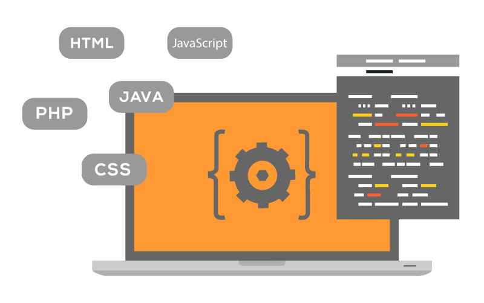

---

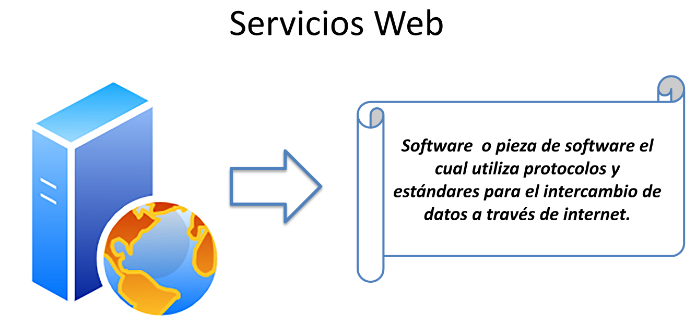

---

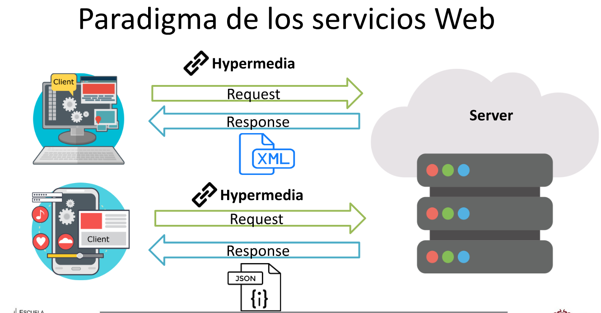

---

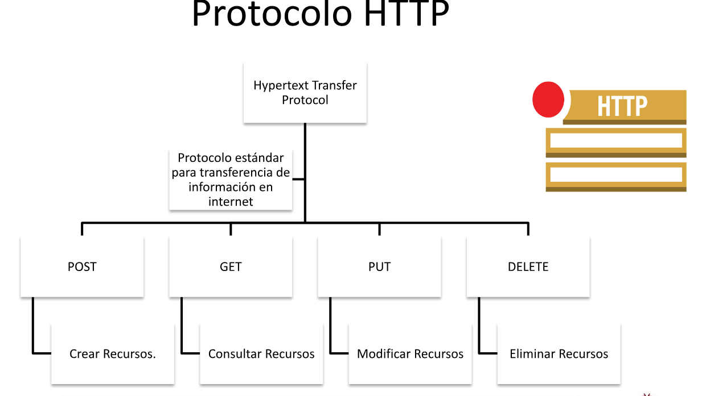

---

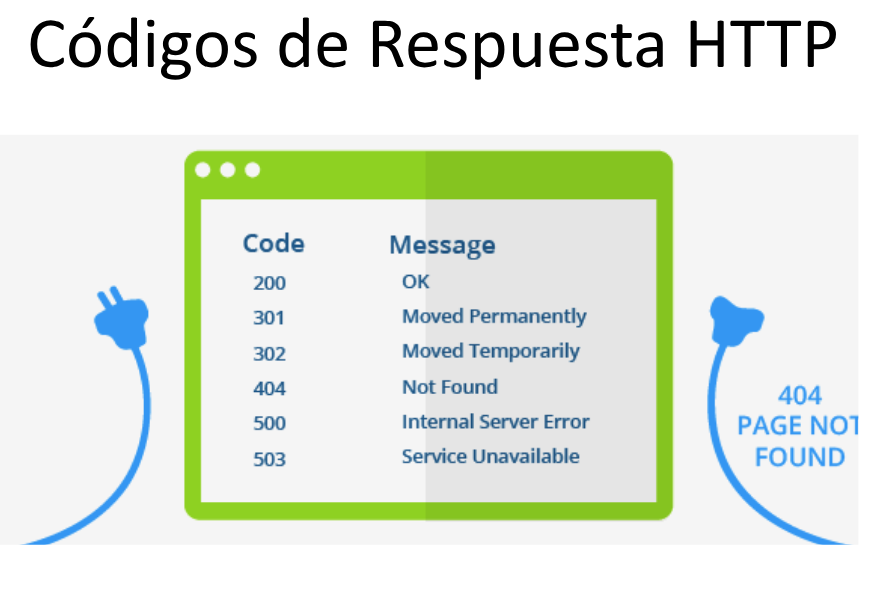

## HTML
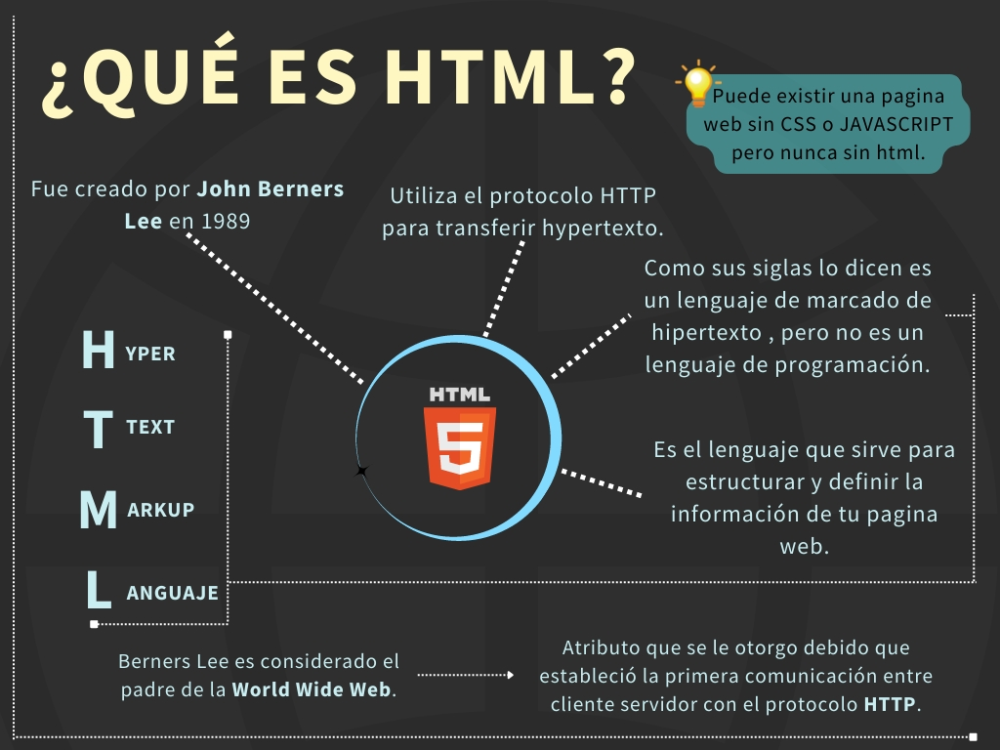

---

### Partes de una página web

:::: {.columns}
::: {.column width="33%"}
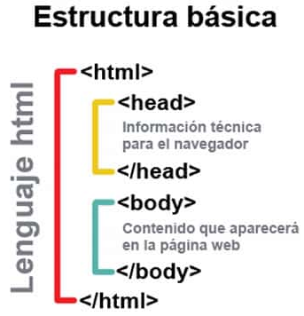

:::
::: {.column width="33%"}
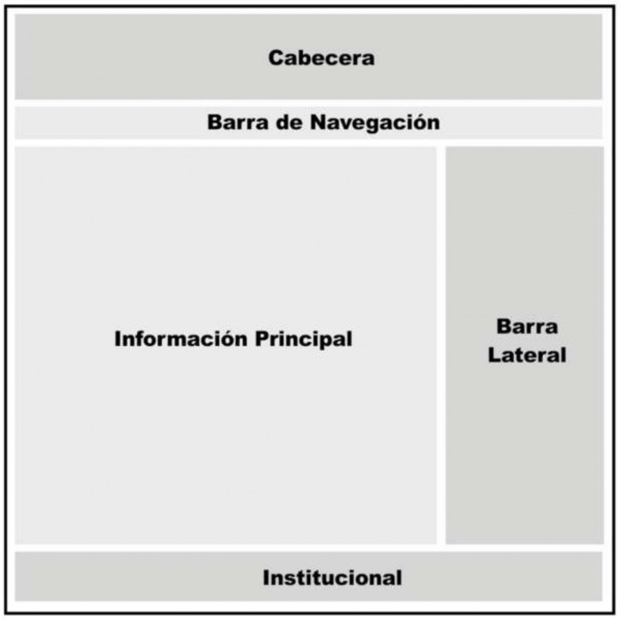

:::
::: {.column width="33%"}

:::
::::

---

### Estructura del código

:::: {.columns}
::: {.column width="50%"}
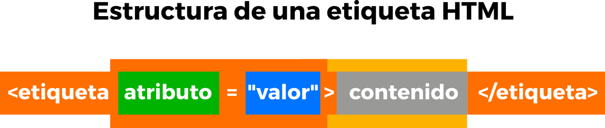

:::
::: {.column width="50%"}
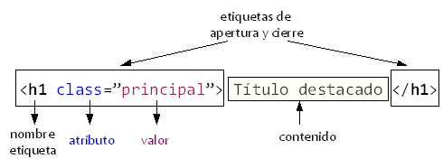

:::
::::

## CSS
* **Cascading Style Sheets**: Lenguaje que maneja el diseño y presentación de páginas web.
* Funciona junto con HTML (encargado del contenido).
* "En cascada": se pueden tener varias hojas con propiedades heredadas.

---

### Propiedades de CSS
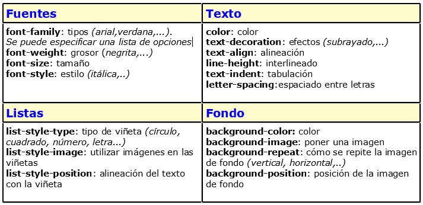

## PHP
* **Hypertext Preprocessor**: Lenguaje para desarrollar aplicaciones web.
* Favorece la conexión entre servidores y la interfaz de usuario.
* Principalmente backend (lado del servidor), pero con utilidades frontend.

---

### Funcionamiento de PHP
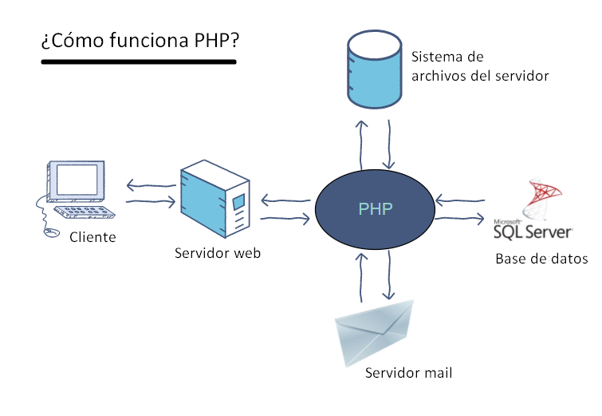

---

### Estructura del código
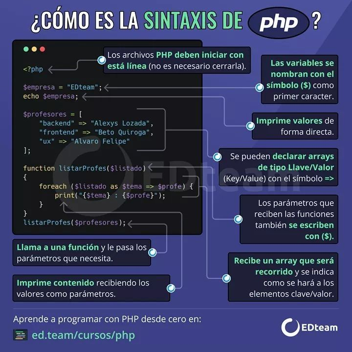

## JavaScript
* Añade interactividad y permite crear aplicaciones web complejas.
* Lenguaje de alto nivel, dinámico, interpretado y orientado a objetos.
* Basado en prototipos, imperativo y débilmente tipado.
* Tecnología esencial junto a HTML y CSS.

---

### Funcionamiento de JavaScript
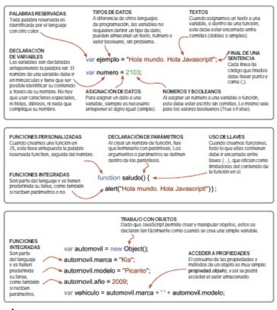

## ¿Qué es SQL?
* **Structured Query Language** (desarrollado por IBM).
* Lenguaje de Consulta Estructurado para comunicarse con BD (editar, seleccionar, filtrar).
* Estándar y motor de las bases de datos.
* Motores comunes: MySQL (rápido), PostgreSQL (robusto), MS SQL Server, DB2, Oracle.

---

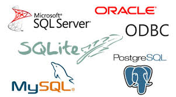

---

### Características
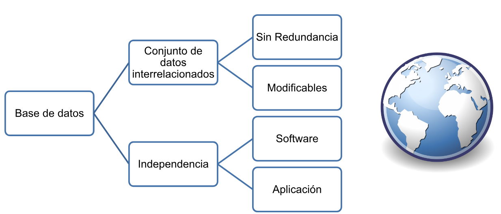

## Bases de Datos
* **Tipos de datos SQL** y Características.
* **Composición**: Tablas (Nombre, Columnas/Atributos, Filas/Registros).
* Creación de tabla y consulta `DESC nombreTabla;`
* Bases de Datos **CRUD** (Create, Read, Update, Delete)

---

### Bases de Datos CRUD
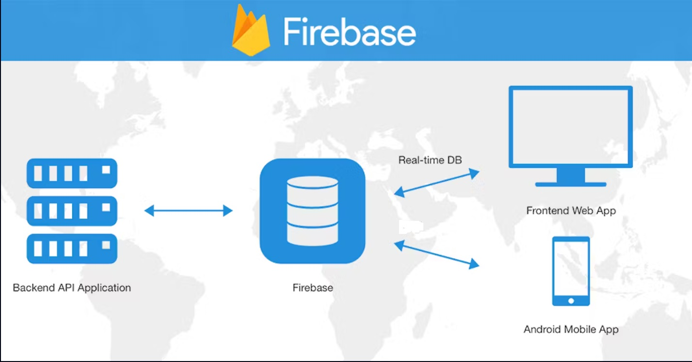

## 🧪 Práctica de Laboratorio

**Actividad:**
Replicar el login visto en clase utilizando todas las tecnologías vistas en clase.
