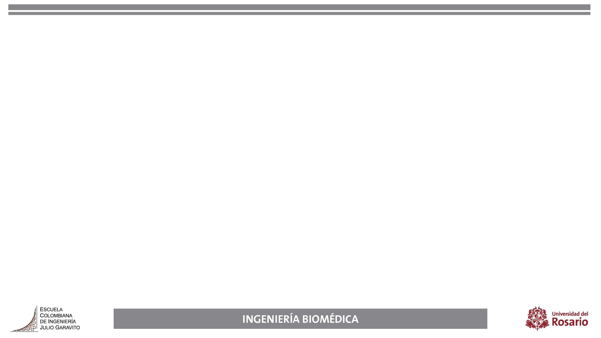
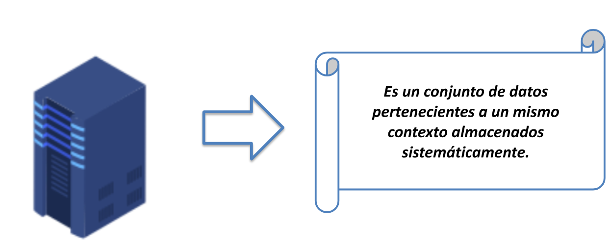
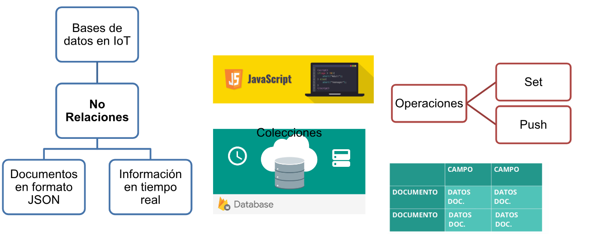
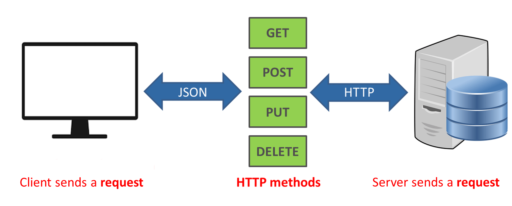
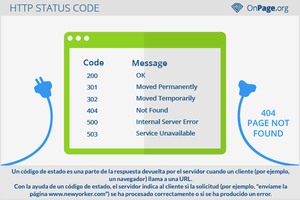

# Servicios Web y Bases de Datos No Relacionales
::: {layout-ncol=2}

:::

## Servicios Web
* Software o pieza de software que utiliza protocolos y estándares para el intercambio de datos a través de internet.
::: {layout-ncol=2}

:::

---

### Paradigma de los servicios Web
* **Request** (Peticiones)
* **Response** (Respuestas)
* **Hypermedia**
* Arquitectura Cliente-Servidor
::: {layout-ncol=2}

:::

## Protocolo HTTP
* **Hypertext Transfer Protocol**
* Protocolo estándar para la transferencia de información en internet.
::: {layout-ncol=2}

:::

---

### Métodos HTTP
* **POST**: Crear Recursos.
* **GET**: Consultar Recursos.
* **PUT**: Modificar Recursos.
* **DELETE**: Eliminar Recursos.
::: {layout-ncol=2}

:::

---

### Códigos de Respuesta HTTP
* Indican el estado de la petición realizada al servidor.
* **Ejemplos:** 
  * 200 (OK)
  * 201 (Created)
  * 404 (Not Found)
  * 500 (Internal Server Error).
::: {layout-ncol=2}

:::

## REST-API
* Interfaz basada en HTTP.
* Permite obtener y modificar datos.
* Operación con datos entre sistemas de manera estandarizada e independiente de lenguaje.
::: {layout-ncol=2}

:::

## Bases de Datos No Relacionales (NoSQL)
* Alternativa a las bases de datos SQL tradicionales (no utilizan tablas estrictas).
* Estructura flexible, escalable y rápida para grandes volúmenes de datos o esquemas dinámicos.
::: {layout-ncol=2}

:::

---

### Formato JSON
* **JavaScript Object Notation**
* Formato ligero de intercambio de datos.
* Estructura basada en pares `clave: valor`.
* Ideal y estándar para comunicación en APIs REST y bases de datos NoSQL.
::: {layout-ncol=2}

:::

---

### Bases de Datos CRUD
Operaciones fundamentales para interactuar con sistemas de datos:

* **C**reate (Crear)
* **R**ead (Leer / Consultar)
* **U**pdate (Actualizar)
* **D**elete (Eliminar)
::: {layout-ncol=3}

:::

## 🧪 Práctica de Laboratorio

**Actividad:**
Replicar el sistema de Login y CRUD de la sesión consumiendo una base de datos NoSQL mediante Firebase y su API REST.
